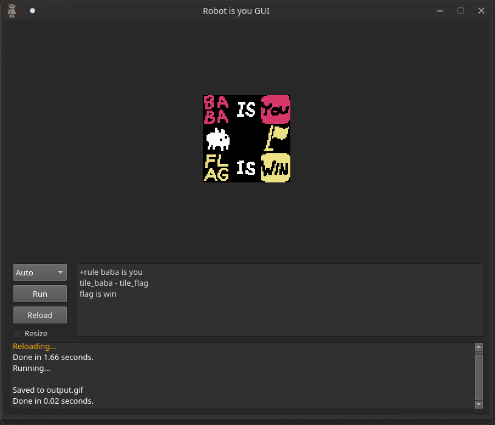
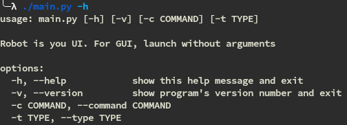

# Robot is you UI

Apparently someone needs a standalone version of the [robot-is-you bot on discord](https://github.com/RocketRace/robot-is-you).

So I made a wrapper for it.

GUI uses PyQt5, the design of the GUI is not great but that's literally the first GUI thing I made so I guess it's ok.

CLI is fine too, but you don't get a preview of the render.

It is important to mention that under the wrappers the core of the bot is still full async, I just block on it.

I tried to make is sync but got some very weird results and actually blocking on it should give the same result.

## I do not plan on maintaining this thing

That's why you should get the `data` folder with all the sprites and stuff yourself,
either from the game or the [original bot](https://github.com/RocketRace/robot-is-you/tree/master/data).

If anyone wants to pick it up, just ping me on the [robot-is-you support server](https://discord.gg/rMX3YPK)
, but I doubt it because the code is a mess.

Not sure if it work on windows too, I think it should with a couple of path tweaks, but I didn't test.

## Usage

### GUI

---

---

GUI should be pretty simple, everyone who is familiar with the discord bot,
should also understand how to use the GUI.

There is also a resize checkbox, if image is larger than image preview size and this flag is on,
the program tries to resize the preview to fit the size, otherwise the image will just crop to size.
Reload button reloads all the tiles, levels, letters and other stuff.

### CLI

CLI shouldn't be hard either.

Quick note: launching the script without flags will open it in GUI mode.

If you want to get help, you need to specifically do `./main.py -h`.

## Final note

This project is pretty unfinished, just pushed it early,
because had basically no time to work on it, but it was at least usable.

I'm almost sure that some stuff is not working, if you notice a bug,
just submit an issue, I won't promise that I will fix it, but I will at least look.

PRs are welcome :)